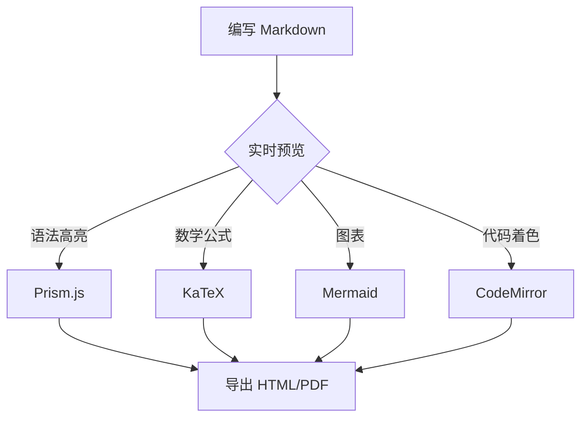
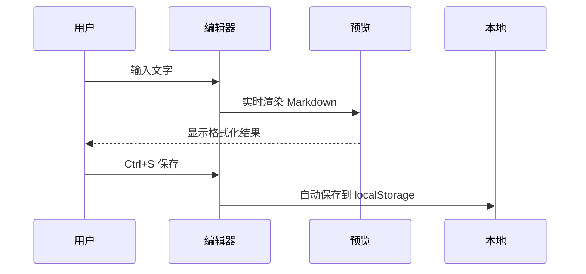

# 欢迎使用 Markdown 编辑器 ✨

**功能齐全**的在线 Markdown 编辑器，支持语法高亮、数学公式、图表和实时预览。

---

## 🎯 核心功能

| 功能 | 说明 |
|------|------|
| 实时预览 | 分栏/编辑/预览三种模式，拖拽调整宽度 |
| 工具栏 | 一键插入 Markdown 语法 + Emoji 选择器 😊 |
| 文件操作 | 新建 / 打开 / 保存 |
| 导出 | 导出 HTML 或打印 PDF |
| 搜索替换 | Ctrl+F 搜索，支持替换全部 |
| 图片粘贴 | 直接粘贴或拖拽图片 |
| 主题切换 | 亮色 / 暗色主题 |
| 自动保存 | 内容自动保存到本地 |
| 目录侧栏 | 自动提取标题结构 📋 |
| 快捷键帮助 | 按 `?` 键查看所有快捷键 |

## 📝 语法示例

### 文本样式

**加粗**、*斜体*、~~删除线~~、`行内代码`

### Emoji

😀 🎉 🚀 💡 🔥 ⚡ 💻 📦 🧪 🎨 🐛 🔧 📖 ✨ 🏆

### 数学公式 (KaTeX)

行内公式: $E = mc^2$

块级公式:

$$\\sum_{i=1}^{n} i = \\frac{n(n+1)}{2}$$

$$\\int_{a}^{b} f(x)\\,dx = F(b) - F(a)$$

### 图表 (Mermaid)



### 时序图



### 代码块 (Prism.js 语法高亮)

```javascript
// 带有语法着色的 JavaScript 代码
function fibonacci(n) {
  if (n <= 1) return n;
  const dp = [0, 1];
  for (let i = 2; i <= n; i++) {
    dp[i] = dp[i - 1] + dp[i - 2];
  }
  return dp[n];
}

console.log(fibonacci(10)); // 55
```

```python
# Python 示例
def quicksort(arr):
    if len(arr) <= 1:
        return arr
    pivot = arr[len(arr) // 2]
    left = [x for x in arr if x < pivot]
    middle = [x for x in arr if x == pivot]
    right = [x for x in arr if x > pivot]
    return quicksort(left) + middle + quicksort(right)

print(quicksort([3, 6, 8, 10, 1, 2, 1]))
```

### 引用

> 简洁是终极的 sophistication。
> —— 达·芬奇

> 代码是写给人看的，顺便能在机器上运行。
> —— Harold Abelson

### 任务列表

- [x] 实时预览
- [x] 工具栏和快捷键
- [x] 文件导入导出
- [x] 代码语法高亮
- [x] 数学公式
- [x] Mermaid 图表
- [x] 编辑器语法着色
- [x] Emoji 选择器
- [x] 目录侧栏
- [ ] 更多功能开发中...

### 表格

| 快捷键 | 功能 |
|--------|------|
| Ctrl+B | 加粗 |
| Ctrl+I | 斜体 |
| Ctrl+K | 插入链接 |
| Ctrl+S | 保存文件 |
| Ctrl+F | 搜索替换 |
| Ctrl+Shift+P | 切换视图 |
| ? | 快捷键帮助 |

---

*开始写作吧！🚀*
